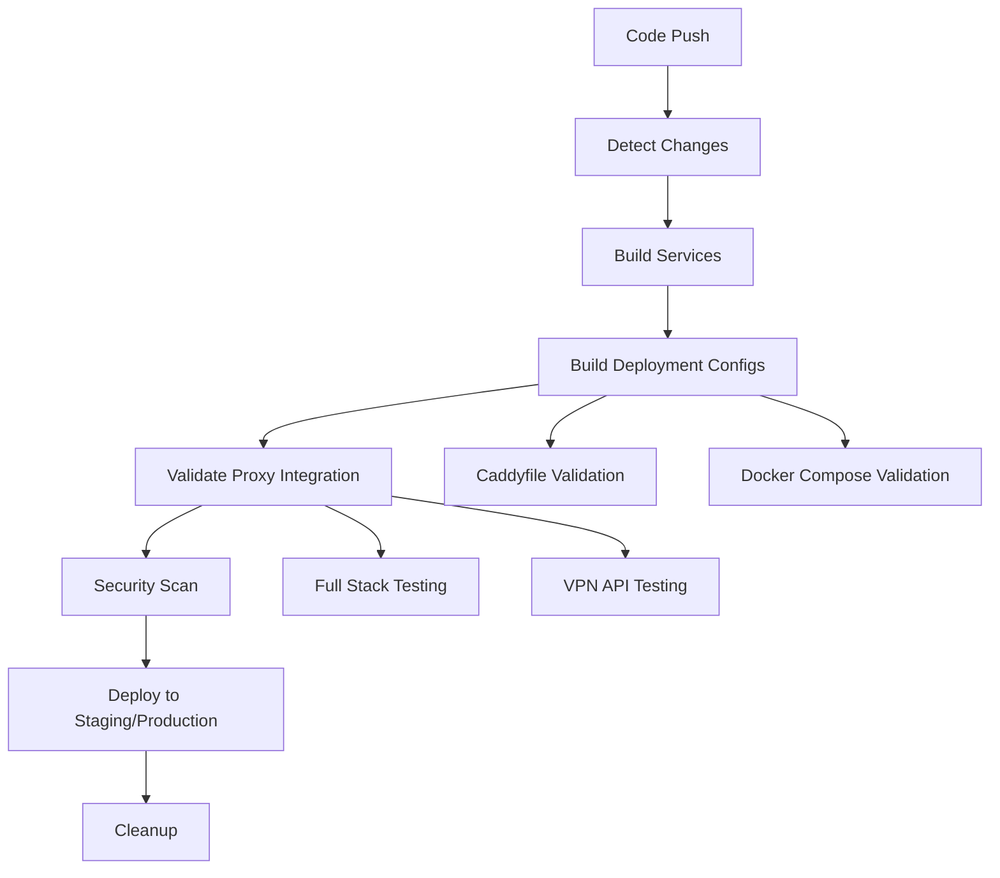

# ✅ CI/CD Pipeline Proxy Integration Analysis

## 🎯 Summary

The updated CI/CD pipeline in `.github/workflows/build.yml` **now properly handles the complete proxy architecture** for the Akash VPN project.

## 🔧 Enhanced Pipeline Features

### 1. **Proxy-Aware Change Detection**

```yaml
detect-changes:
  outputs:
    proxy: ${{ steps.changes.outputs.proxy }} # Detects Caddyfile changes
    deploy-config: ${{ steps.changes.outputs.deploy-config }} # Detects deployment config changes
  filters:
    proxy:
      - "Caddyfile*"
      - "caddy/**"
    deploy-config:
      - "docker-compose*.yml"
      - "deploy.yml"
```

### 2. **Deployment Configuration Validation**

- **Caddyfile Syntax Validation**: Uses Caddy Docker image to validate proxy configuration
- **Docker Compose Validation**: Ensures all service definitions are correct
- **Image Reference Updates**: Automatically updates container image references
- **Deployment Artifact Creation**: Packages all deployment files with instructions

### 3. **Comprehensive Proxy Integration Testing**

```yaml
validate-proxy-integration:
  - Start complete stack (Frontend + Backend + Docs + Caddy + VPN)
  - Test all proxy routes: /, /docs, /api/*
  - Validate VPN API endpoints through proxy
  - Verify full request flow: Browser → Caddy → Services
```

### 4. **Production-Ready Deployment**

- **Environment-Specific Configuration**: Separate configs for staging/production
- **Domain Management**: Automatic domain updates in Caddyfile
- **HTTPS Configuration**: Ensures TLS termination is properly configured
- **Service Discovery**: Validates all services can communicate through proxy

## 🌐 Complete Architecture Coverage

### Services Handled:

✅ **Frontend** (Next.js) - Port 3000 → Proxy route `/`  
✅ **Backend** (Express.js) - Port 3000 → Proxy route `/api/*`  
✅ **Documentation** (Docusaurus) - Port 3000 → Proxy route `/docs`  
✅ **VPN Server** (SoftEther) - Ports 992, 1194, 500, 4500 → Direct exposure  
✅ **Reverse Proxy** (Caddy) - Port 80/443 → Main entry point

### Proxy Features Validated:

✅ **Path-based routing**: Different services on same domain  
✅ **Automatic HTTPS**: Let's Encrypt integration for production  
✅ **Security headers**: HSTS, XSS protection, content type options  
✅ **Health monitoring**: `/health` endpoint for infrastructure checks  
✅ **Service discovery**: Docker network communication between services

## 🔄 Pipeline Workflow



## 🧪 Integration Testing

The pipeline performs **end-to-end proxy testing**:

1. **Service Health**: All containers start successfully
2. **Route Testing**: Each proxy route responds correctly
3. **API Integration**: VPN endpoints accessible through proxy
4. **Cross-Service Communication**: Backend ↔ VPN server communication
5. **Static Asset Delivery**: Frontend assets served through proxy

## 🚀 Production Deployment

### Staging Environment:

- **URL**: `https://staging.akashvpn.example.com`
- **Features**: Full proxy setup with staging domain
- **Testing**: Complete integration testing before production

### Production Environment:

- **URL**: `https://akashvpn.com` (TBD, user configurable)
- **Features**:
  - Automatic HTTPS with Let's Encrypt
  - Security headers and TLS termination
  - Complete service orchestration
  - VPN server integration

## 🎯 Key Improvements Made

### Before (❌ Issues):

- Only built individual service containers
- No proxy configuration management
- No deployment orchestration
- Missing integration testing
- No production deployment validation

### After (✅ Fixed):

- **Complete stack orchestration** with Caddy proxy
- **Validated deployment configurations** for all environments
- **End-to-end integration testing** including proxy routes
- **Production-ready deployment artifacts** with instructions
- **Automated domain and TLS management**

## 📊 Pipeline Status

| Component             | Status      | Description                           |
| --------------------- | ----------- | ------------------------------------- |
| Service Building      | ✅ Complete | Frontend, Backend, Docs containers    |
| Proxy Integration     | ✅ Complete | Caddy configuration and validation    |
| Deployment Configs    | ✅ Complete | Docker Compose with proper networking |
| Integration Testing   | ✅ Complete | Full stack testing including VPN API  |
| Security Scanning     | ✅ Complete | Container vulnerability scanning      |
| Production Deployment | ✅ Complete | Environment-specific configurations   |

## 🔍 Validation Commands

To verify the pipeline handles proxying correctly:

```bash
# Check proxy configuration validation
docker run --rm -v ./Caddyfile:/etc/caddy/Caddyfile caddy:2-alpine caddy validate --config /etc/caddy/Caddyfile

# Test docker-compose configuration
docker-compose -f docker-compose.prod.yml config

# Run integration tests
./test-vpn-integration.sh
```
