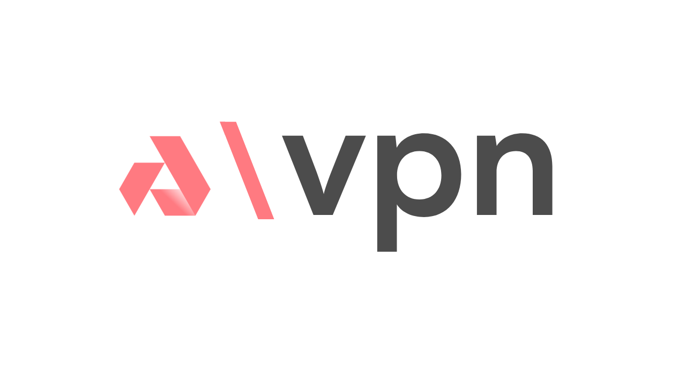

# Akash VPN 🌐

**Decentralized Privacy for Everyone - Powered by Akash Network**

A comprehensive, decentralized VPN solution built on the Akash Network. Akash VPN provides secure, private internet access without centralized control, leveraging the power of decentralized cloud infrastructure.

---

## 🏗️ Project Architecture

This repository contains four core components that together form the Akash VPN ecosystem:

### 📚 [Documentation](../akash-vpn-docs/)
Comprehensive guides, setup instructions, and technical documentation built with Docusaurus.

### 🖥️ [Web Frontend](../frontend/)
Modern React/Next.js user interface featuring a stunning 3D globe visualization and intuitive VPN controls.

### 🔒 [VPN Server](../vpn/)
SoftEther VPN server implementation providing multi-protocol support (OpenVPN, L2TP/IPsec, SSL-VPN).

### ⚡ [API Server](../server/)
Backend service handling user authentication, server management, and VPN configuration.

---

