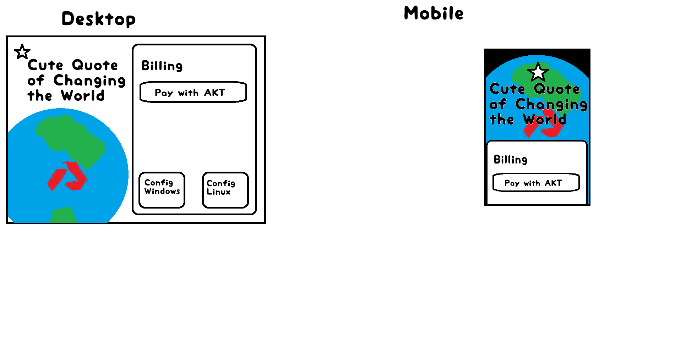

# Make an SDL File [Beginner]
please make an SDL file for our VPN SaaS
## What Specifically Needs to Be Done (Deliverables)
### [1st Deliverable]
Create a simple SDL file that defines our VPN service. Keep it basic, we're not writing a novel.
### [Additional Info]
check out this image I drew to help you out
. Use this as inspiration for the service description

**What to include:**
- Service name and basic description
- Main features (connect/disconnect, server selection)
- User roles (free user, premium user)
- Basic data flows (how users connect to VPN)
- Keep it simple, we're not building AWS here

**Tools to use:**
- Draw.io (free and easy)
- Or just use text/ASCII art if you're feeling creative
- Or even just bullet points in a markdown file

The goal is to have a basic blueprint, not a masterpiece.

### [2nd Deliverable]
Commit your SDL file to the github repo
### [Additional Info]
that is all
### [1st Deliverable]: 1 hours
Summary: create a basic SDL file for VPN service.
### [2nd Deliverable]: 0 hours
Summary: commit SDL file to repo.
Total Estimated Time: 1 hours
